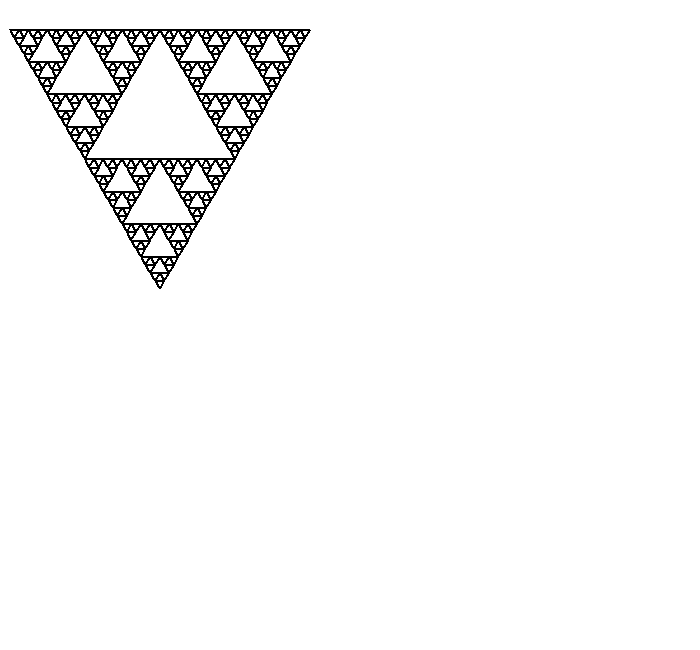
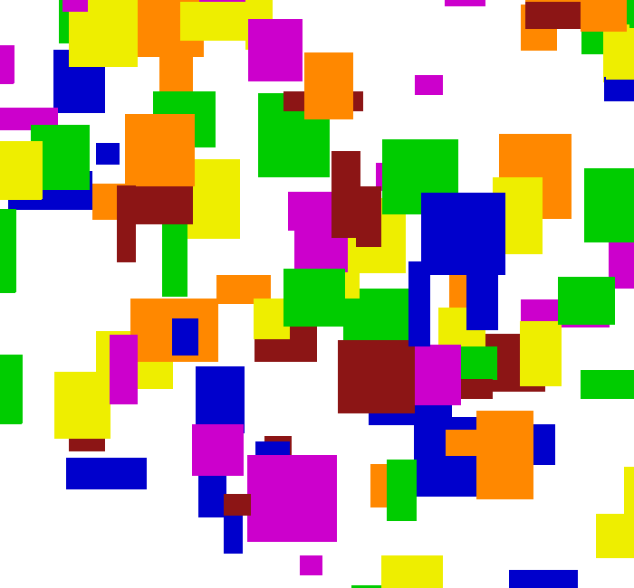

# Fractals and Graphics

Sierpinski triangles and flood fill written in C++ as an assignment for CS106B at Stanford Summer Session 2019.

## Sierpinski triangles

The **Sierpinski triangle** is a [fractal](https://www.wikiwand.com/en/Fractal) and [attractive fixed set](https://www.wikiwand.com/en/Attractive_fixed_set) with the overall shape of an [equilateral triangle](https://www.wikiwand.com/en/Equilateral_triangle), subdivided [recursively](https://www.wikiwand.com/en/Recursion) into smaller equilateral triangles. ([Wikipedia](https://www.wikiwand.com/en/Sierpi%C5%84ski_triangle))

## Flood fill

**Flood fill,** also called **seed fill,** is an [algorithm](https://www.wikiwand.com/en/Algorithm) that determines the area [connected](https://www.wikiwand.com/en/Glossary_of_graph_theory#Connectivity) to a given node in a multi-dimensional [array](https://www.wikiwand.com/en/Array_data_structure). It is used in the "bucket" fill tool of [paint programs](https://www.wikiwand.com/en/Paint_program) to fill connected, similarly-colored areas with a different color, and in games such as [Go](https://www.wikiwand.com/en/Go_(game)) and [Minesweeper](https://www.wikiwand.com/en/Minesweeper_(video_game)) for determining which pieces are cleared. ([Wikipedia](https://www.wikiwand.com/en/Flood_fill))

# Installation

1. Download or clone this project.
2. Load this project into Qt Creator.
3. Build and run in Qt Creator.

# Credits

Assignment by Chris Gregg, Chris Piech, Marty Stepp, and Victoria Kirst. Originally based on a problem by Julie Zelenski and Jerry Cain. Updates by Tyler Conklin. This project uses various libraries from [the Stanford C++ Libraries](http://web.stanford.edu/~stepp/cppdoc/).